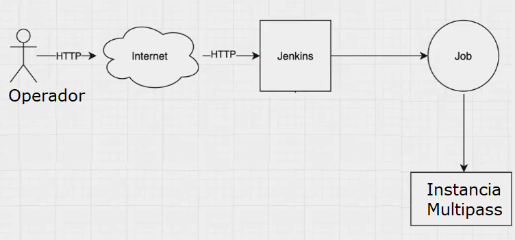

# Bootcamp DevOps Engineer by EducacionIT 2024~2025
### realizado por Hernán Fernández Brando

## Desafío#01
### Objetivo
Desarrollar un pipeline declarativo en Jenkins que nos permita crear usuarios dentro de un sistema linux.

### Escenario
El área de seguridad cuenta con un equipo que tiene la responsabilidad de **gestionar la creación de y baja de usuarios en los sistemas de la empresa**.
Debido a que en el último tiempo hay muchos ingresos algunos operadores cometieron algunos errores y nos encomendaron generar **una herramienta (job) en jenkins que permita generar estos usuarios**.

### Requisitos
1. El operador de seguridad informática desea que al momento de crear el usuario se tomen estos datos de entrada

| Dato | Descripción |
| ----- | ---------- |
| Login | Es un identificador único que se compone del nombre y el apellido |
| Nombre y Apellido | Nombre y Apellido del usuario. Cada uno en un campo diferente (sino sería exactamente lo mismo que login). | 
| Departamento | Este es el grupo que corresponde al área del usuario. Estos grupos son: contabilidad, finanzas, tecnología. |

2. Requiere que la automatización generé un password temporal que sea asignado al usuario y que luego el usuario final deberá cambiar en el primer inicio de sesión.
2. El operador requiere que pueda obtener la password temporal para copiarla y enviarla por email al usuario final.
2. También quieren otro job que permita eliminar el usuario, este debe recibir el id de usuario como nombre, debe eliminar tanto grupo del usuario como el home del mismo.

### Entregables

Los entregables establecidos para este proyecto con:
1. Código fuente del pipeline de Jenkins publicado en un repositorio de Github.
2. Guía detallada de cómo utilizar el job publicada en el archivo README.md del
repositorio.
3. Evidencia de las pruebas con resultado exitoso.

#### Entregable 0. Preparación del entorno

Previo a la ejecución de los pipeline fue necesario realizar las siguientes acciones:
1. aumentar la capacidad del disco de la instancia de multipass.
Al hacer build en algunas pruebas del desarrollo, jenkins se quedaba colgado en la sección build history diciendo `(pending—Waiting for next available executor)` Hice unos updates que decía eran críticos, y tenía menos de 1gb libre.

```bash
C:\Windows\system32>multipass info devopsbootcamp
Name:           devopsbootcamp
State:          Running
Snapshots:      0
IPv4:           172.29.210.136
Release:        Ubuntu 24.04.1 LTS
Image hash:     fad101d50b06 (Ubuntu 24.04 LTS)
CPU(s):         1
Load:           0.20 0.16 0.07
Disk usage:     3.0GiB out of 4.8GiB
Memory usage:   554.9MiB out of 896.3MiB
Mounts:         --
```

Aumenté 2gb de disco.

`multipass set local.devopsbootcamp.disk=7G`

y automáticamente al abrir jenkins ya estaba funcionando el job en cuestión.

2. Agregar el usuario `jenkins` al grupo `sudo`, de manera que se puedan ejecutar operaciones de superusuario en los pipeline de jenkins.


```bash
ubuntu@devopsbootcamp:~$ sudo usermod -aG sudo jenkins
ubuntu@devopsbootcamp:~$ cat /etc/group | grep sudo
sudo:x:27:ubuntu,jenkins
```
3. A pesar de agregar el usuario jenkins al grupo sudo permite que ejecute comandos con privilegios de superusuario, pero aún había un problema relacionado con la configuración de sudo: el comando requería contraseña al ejecutarse el job.
```bash
...
+ sudo useradd PepitoElNuevoUsuario -m -s /bin/bash -d /home/PepitoElNuevoUsuario -c Pepito El Nuevo Usuario -p $1$uI2AOKaX$EZii6D2sgvOc4ck/SwveR0
sudo: a terminal is required to read the password; either use the -S option to read from standard input or configure an askpass helper
sudo: a password is required
...
ERROR: script returned exit code 1
Finished: FAILURE
```
Cuando Jenkins ejecuta comandos a través de un pipeline, a priori no tiene acceso a una terminal interactiva donde pueda pedir una contraseña. Por lo tanto, los comandos que requieren ingresar una contraseña fallarán, si se busca que la interfaz de uso sea lo más simple posible que genere un nuevo usuario a partir de algunos parámetros nada más.
La forma más efectiva de solucionar esto es editar el archivo de configuración de `sudoers`, para permitir que el usuario jenkins ejecute el comando useradd (o cualquier otro comando necesario) como super usuario sin que se requiera ingresar la contraseña. Se puede hacer con el comando `sudo visudo` o editando el archivo `/etc/sudoers.d/jenkins`, agregando al final del archivo `jenkins ALL= NOPASSWD: ALL`.


#### Entregable 1. Códigos Fuente Jenkins

##### Creación de Usuarios

```groovy
pipeline {  
    agent any  
    parameters {  
        string(name: 'login', defaultValue: '', description: 'Ingresa un identificador único, por defecto es el nombre y apellido sin espacios (por defecto nombreapellido)')  
        string(name: 'Nombre', defaultValue: '', description: 'Ingresa el Nombre del usuario a dar de alta (requerido)')  
        string(name: 'Apellido', defaultValue: '', description: 'Ingresa el Apellido del usuario a dar de alta (requerido)')  
        choice(name: 'Departamento', choices: ['Contabilidad', 'Finanzas', 'Tecnología'], description: 'Grupo que corresponde al área de trabajo del usuario en cuestión (requerido)')  
    }  
    environment {  
        NOMBRE_EMPRESA = "FabricaDeBurletes"  
        ANIO_EN_CURSO = "${new java.util.Date().format('yyyy')}"   
        nombreSinEspacios = params.Nombre.replaceAll(" ", "")  
        apellidoSinEspacios = params.Apellido.replaceAll(" ", "")  
        LOGIN_AUTO = "${nombreSinEspacios}${apellidoSinEspacios}"
        LOGIN = "${params.login ?: env.LOGIN_AUTO}" // Usa params.login si no está vacío, sino usa LOGIN_AUTO
        LOGIN = LOGIN.toLowerCase()  
        PASSWORD_GENERADO = "${nombreSinEspacios}-${apellidoSinEspacios}@${NOMBRE_EMPRESA}_${env.ANIO_EN_CURSO}"  
    }  
    stages {  
        stage('Validation') {  
            steps {  
                script {  
                    if (!params.Nombre || !params.Apellido || !params.Departamento) {  
                        error "El Nombre, el Apellido y el departamento son parámetros obligatorios."  
                    }  
                    userExists = sh(script: "cat /etc/passwd | grep -w ${env.LOGIN}", returnStatus: true) == 0  
                    if (userExists) {  
                        error "El usuario '${params.username}' ya existe en el sistema. Pruebe con un login distinto."  
                    }
                }  
            }  
        }  
        stage('UserSignUp') {  
            steps {  
                script {  
                    sh """  
                        sudo useradd ${env.LOGIN} -m -s /bin/bash -d /home/${env.LOGIN} -c "${params.Nombre} ${params.Apellido}" -p \$(echo "${env.PASSWORD_GENERADO}" | openssl passwd -1 -stdin)  
                        sudo chage -d 0 ${env.LOGIN}  
                    """  
                    echo "El usuario ${env.LOGIN} fue creado exitosamente."  
                    echo "El usuario ${env.LOGIN} tiene por contraseña inicial: ${env.PASSWORD_GENERADO}"  
                    echo "La contraseña deberá ser cambiada luego de iniciar sesión por primera vez."  
                    echo "Gracias por utilizar el sistema de creación de usuarios!"  
                }  
            }  
        }  
    }  
}
```

##### Eliminación de Usuarios
```groovy
pipeline {  
    agent any  
    parameters {  
        string(name: 'username', defaultValue: '', description: 'Ingresa el nombre de usuario a borrar (requerido)')  
    }  
    stages {  
        stage('Validation') {  
            steps {  
                script {  
                    if (!params.username) {  
                        error "El nombre de usuario es un parámetro obligatorio."  
                    }  

                    userExists = sh(script: "cat /etc/passwd | grep -w ${params.username}", returnStatus: true) == 0  
                    if (!userExists) {  
                        error "El usuario '${params.username}' no existe en el sistema."  
                    }
                }  
            }  
        }  
        stage('UserDeletion') {  
            steps {  
                script {  
                    // Borra el usuario  
                    sh "sudo userdel -r ${params.username}"  
                    echo "El usuario '${params.username}' fue borrado exitosamente."  
                    
                    // Borra el grupo creado con el usuario  
                    groupExists = sh(script: "cat /etc/group | grep -w ${env.LOGIN}", returnStatus: true) == 0  
                    if (groupExists) {  
                        sh "sudo groupdel ${params.username}"  
                        echo "El grupo '${params.username}' fue borrado exitosamente."  
                    }
                }  
            }  
        }  
    }  
}
```

#### Entregable 2. Guía de cómo utilizar los job
Las mismas se encuentran en archivos readme adjuntos a la presente entrega y también a continuación.

##### Readme Creación de Usuarios

# Creación de Usuarios

Este pipeline de Jenkins permite la creación de usuarios en el sistema de manera sencilla y controlada. A continuación, se describe cómo utilizar este job y los parámetros requeridos.

## Funcionamiento del Pipeline

1. **Parámetros de Entrada**:
   - **`login`**: Identificador único para el usuario (opcional). Si no se proporciona, se genera automáticamente a partir del nombre y apellido.
   - **`Nombre`**: Nombre del usuario a crear (requerido).
   - **`Apellido`**: Apellido del usuario a crear (requerido).
   - **`Departamento`**: Área de trabajo del usuario (requerido). Las opciones disponibles son: 'Contabilidad', 'Finanzas', 'Tecnología'.

2. **Procesamiento**:
   - Se valida que `Nombre`, `Apellido` y `Departamento` no estén vacíos.
   - Se genera un login a partir del nombre y apellido y se convierte a minúsculas. Si se ha ingresado el parámetro login, también se convierte a minúsculas.
   - Se verifica si el usuario existe en el sistema a través de la búsqueda en `/etc/passwd`. Si existe el usuario que se va a crear, se arroja un error.
   - Se crea una contraseña inicial basada en el formato `nombre-apellido@empresa_año`.

3. **Creación de Usuario**:
   - Se ejecuta el comando `useradd` para crear el usuario, y se establece una contraseña temporal que deberá ser cambiada en el primer inicio de sesión.

## Cómo Utilizar el Job

1. Accede al job de Creación de Usuarios en Jenkins.
1. Rellena los parámetros obligatorios:
   - Especifica el `Nombre`, `Apellido`, y selecciona un `Departamento`.
   - Opcionalmente, puedes ingresar un `login` único.
1. Ejecuta el job.
1. Al finalizar, recibirás un mensaje confirmando la creación del usuario y la contraseña inicial.

### Contacto
Si encuentras problemas o tienes preguntas sobre el uso de este pipeline, no dudes en contactar al administrador del sistema.

##### Readme Eliminación de Usuarios

# Eliminación de Usuarios

Este pipeline de Jenkins permite eliminar usuarios del sistema de manera segura y controlada. A continuación, se describe cómo utilizar este job y los parámetros requeridos.

## Funcionamiento del Pipeline

1. **Parámetros de Entrada**:
   - **`username`**: Nombre del usuario que se desea eliminar (requerido).

2. **Procesamiento**:
   - Se valida que el `username` no esté vacío.
   - Se verifica si el usuario existe en el sistema a través de la búsqueda en `/etc/passwd`.

3. **Eliminación de Usuario**:
   - Si el usuario existe, se ejecuta el comando `userdel` para eliminar el usuario y su directorio home.
   - Se eliminará también el grupo correspondiente asociado al usuario mediante `groupdel`.

## Cómo Utilizar el Job

1. Accede al job de Eliminación de Usuarios en Jenkins.
2. Ingresa el `username` del usuario que deseas eliminar.
3. Ejecuta el job.
4. Recibirás un mensaje confirmando la eliminación del usuario y del grupo correspondiente.

### Contacto
Si encuentras problemas o tienes preguntas sobre el uso de este pipeline, no dudes en contactar al administrador del sistema.

#### Entregable 3. Evidencia de las pruebas con resultado exitoso

##### Creación de Usuarios
```bash
Started by user Hernán F.B.
[Pipeline] Start of Pipeline
[Pipeline] node
Running on Jenkins in /var/lib/jenkins/workspace/desafio01/createLinuxUser
[Pipeline] {
[Pipeline] withEnv
[Pipeline] {
[Pipeline] stage
[Pipeline] { (Validation)
[Pipeline] script
[Pipeline] {
[Pipeline] }
[Pipeline] // script
[Pipeline] }
[Pipeline] // stage
[Pipeline] stage
[Pipeline] { (UserSignUp)
[Pipeline] script
[Pipeline] {
[Pipeline] sh
+ echo Juancito-ElNuevoUsuario@FabricaDeBurletes_2024
+ openssl passwd -1 -stdin
+ sudo useradd JuancitoElNuevoUsuario -m -s /bin/bash -d /home/JuancitoElNuevoUsuario -c Juancito El Nuevo Usuario -p $1$tLqlHlS8$XXqBfWZ0np9rQO78LH6NP/
+ sudo chage -d 0 JuancitoElNuevoUsuario
[Pipeline] echo
El usuario JuancitoElNuevoUsuario fue creado exitosamente.
[Pipeline] echo
El usuario JuancitoElNuevoUsuario tiene por contraseña inicial: Juancito-ElNuevoUsuario@FabricaDeBurletes_2024
[Pipeline] echo
La contraseña deberá ser cambiada luego de iniciar sesión por primera vez.
[Pipeline] echo
Gracias por utilizar el sistema de creación de usuarios!
[Pipeline] }
[Pipeline] // script
[Pipeline] }
[Pipeline] // stage
[Pipeline] }
[Pipeline] // withEnv
[Pipeline] }
[Pipeline] // node
[Pipeline] End of Pipeline
Finished: SUCCESS
```

##### Eliminación de Usuarios

```bash
Started by user Hernán F.B.
[Pipeline] Start of Pipeline
[Pipeline] node (hide)
Running on Jenkins in /var/lib/jenkins/workspace/desafio01/deleteLinuxUser
[Pipeline] {
[Pipeline] stage
[Pipeline] { (Validation)
[Pipeline] script
[Pipeline] {
[Pipeline] sh
+ cat /etc/passwd
+ grep -w JuancitoElNuevoUsuario
JuancitoElNuevoUsuario:x:1002:1002:Juancito El Nuevo Usuario:/home/JuancitoElNuevoUsuario:/bin/bash
[Pipeline] }
[Pipeline] // script
[Pipeline] }
[Pipeline] // stage
[Pipeline] stage
[Pipeline] { (UserDeletion)
[Pipeline] script
[Pipeline] {
[Pipeline] sh
+ sudo userdel -r JuancitoElNuevoUsuario
userdel: JuancitoElNuevoUsuario mail spool (/var/mail/JuancitoElNuevoUsuario) not found
[Pipeline] echo
El usuario 'JuancitoElNuevoUsuario' fue borrado exitosamente.
[Pipeline] sh
+ cat /etc/group
+ grep -w null
[Pipeline] }
[Pipeline] // script
[Pipeline] }
[Pipeline] // stage
[Pipeline] }
[Pipeline] // node
[Pipeline] End of Pipeline
Finished: SUCCESS
```

#### Entregable 4. Material de Soporte Adicional, diagrama de alto nivel

